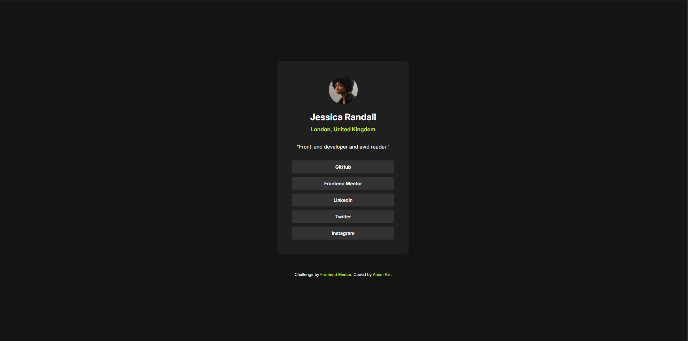

# Frontend Mentor - Social links profile solution

This is a solution to the [Social links profile challenge on Frontend Mentor](https://www.frontendmentor.io/challenges/social-links-profile-UG32l9m6dQ). Frontend Mentor challenges help you improve your coding skills by building realistic projects. 

## Table of contents

- [Overview](#overview)
  - [The challenge](#the-challenge)
  - [Screenshot](#screenshot)
  - [Links](#links)
- [My process](#my-process)
  - [Built with](#built-with)
  - [What I learned](#what-i-learned)
  - [Continued development](#continued-development)
  - [Useful resources](#useful-resources)
- [Author](#author)
- [Acknowledgments](#acknowledgments)


## Overview

### The challenge

Users should be able to:

- See hover and focus states for all interactive elements on the page

### Screenshot




### Links

- Solution URL: [View My Solution](https://github.com/PalAman-git/frontend-mentor-challenges/tree/main/social-links-profile-main)
- Live Site URL: [🚀](https://palaman-git.github.io/frontend-mentor-challenges/social-links-profile-main/)

## My process

### Built with

- Semantic HTML5 markup
- CSS custom properties
- Flexbox

### What I learned

I tried to apply the html semantic tags where ever I could have used , still learning about the HTML semantic tags.
Tried writing the media queries myself 😎, uptill now I used tailwind css to handle the responsive media queries

To see how you can add code snippets, see below:

```css
.proud-of-this-css {

  @media (max-width:375px){
      .avatar-jessica{
        height: 60px;
        width: 60px;
      }
      .name{
        font-size: 20px;
      }
      .location{
        font-size: 12px;
      }
      .profession{
        font-size: 10px;
      }
      .attribution{
        font-size: 10px;
      }
    }
}
```

### Continued development

I want to continue learning the HTML semantics, writing the media query with mobile first approach as it is industry standard.
I want to explore about the accessiblity more and learn about it.
Continue reading the book , You don't know JS and honestly this book is a gold standard for learning about js.


### Useful resources

- [ChatGPT](https://chatgpt.com) - Like all of you I also used the ChatGPT 😂 to review my code and it gave me suggestion about how to improve the media query and html semantics
- [MDN docs](https://developer.mozilla.org/en-US/) - Amazing resource for learning anything in web.

## Author

- Frontend Mentor - [@PalAman-git](https://www.frontendmentor.io/profile/PalAman-git)


